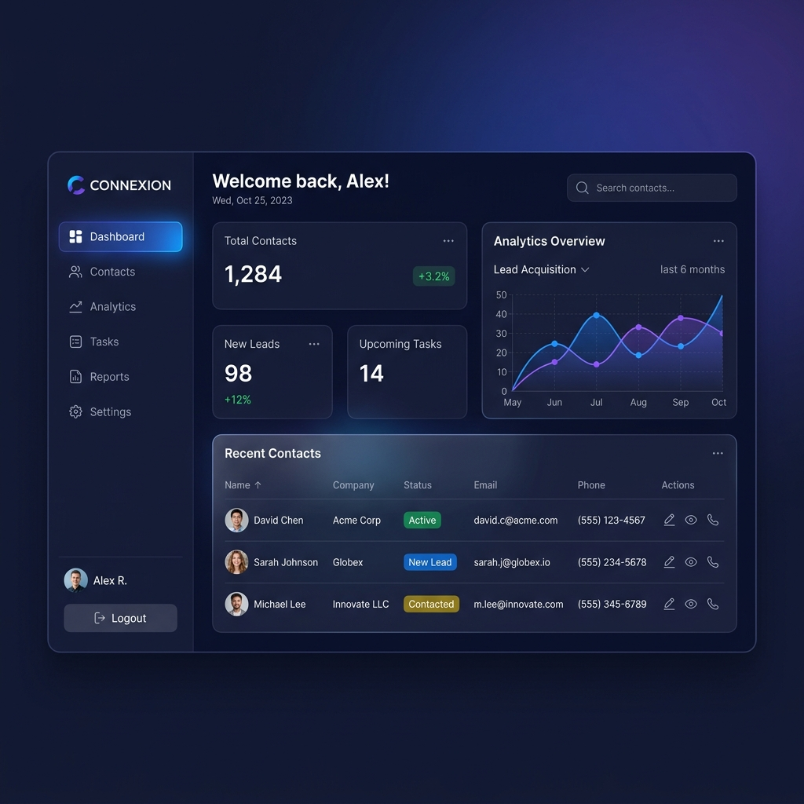

# 🚀 ContactPro - Premium Contact Management System

[](https://reactjs.org/)
[](https://vitejs.dev/)
[](https://tailwindcss.com/)
[](LICENSE)

**ContactPro** is a professional-grade, feature-rich Contact Management System designed for modern workflows. Built with a focus on premium aesthetics, seamless user experience, and robust data management, it provides everything you need to manage your professional relationships effectively.



## ✨ Key Features

- 📊 **Advanced Analytics**: Gain deep insights into your contact database with interactive and beautiful data visualizations powered by Recharts.
- 👥 **Smart Contact Management**: Full CRUD operations for contacts, including categorization (Clients, leads, vendors), gender profiling, and interaction scoring.
- 🔔 **Follow-Up System**: Stay on top of your outreach with an integrated tracking system for pending, completed, and upcoming follow-ups.
- 📋 **Integrated Task Board**: Organize your daily operations with a powerful drag-and-drop task management board powered by @hello-pangea/dnd.
- 📂 **Import/Export**: Seamlessly migrate your data with built-in CSV import and export functionality using PapaParse.
- 🌓 **Premium Dark Mode**: A sophisticated dark theme designed with deep navy and indigo accents for a premium feel, along with a clean light mode.
- 📱 **Fully Responsive Layout**: Experience professional management on any device, from desktop monitors to mobile phones.

## 🛠️ Technology Stack

- **Core**: [React 19](https://reactjs.org/) & [Vite](https://vitejs.dev/)
- **Routing**: [React Router 7](https://reactrouter.com/)
- **Styling**: [Tailwind CSS](https://tailwindcss.com/)
- **Icons**: [Lucide React](https://lucide.dev/)
- **Data Visualization**: [Recharts](https://recharts.org/)
- **Data Parsing**: [PapaParse](https://www.papaparse.com/)
- **Drag & Drop**: [@hello-pangea/dnd](https://github.com/hello-pangea/dnd)
- **HTTP Client**: [Axios](https://axios-http.com/)

## 🚀 Getting Started

Follow these steps to set up the project locally:

### 1. Clone the repository
```bash
git clone https://github.com/your-username/contact-management-system.git
cd contact-management-system
```

### 2. Install dependencies
```bash
npm install
```

### 3. Start the development server
```bash
npm run dev
```

The application will be available at `http://localhost:5173`.

## 📂 Project Structure

```bash
src/
├── components/      # Reusable UI and Layout components
│   ├── layout/      # Sidebar, Header, DashboardLayout
│   └── ui/          # Buttons, Cards, Badges
├── context/         # Auth and Theme context providers
├── pages/           # Main application pages (Dashboard, Contacts, etc.)
│   └── auth/        # Login and Signup pages
├── services/        # API and Data services
└── assets/          # Static assets and global styles
```

## 📝 License

This project is licensed under the MIT License.

---
Designed with ❤️ for premium productivity.
